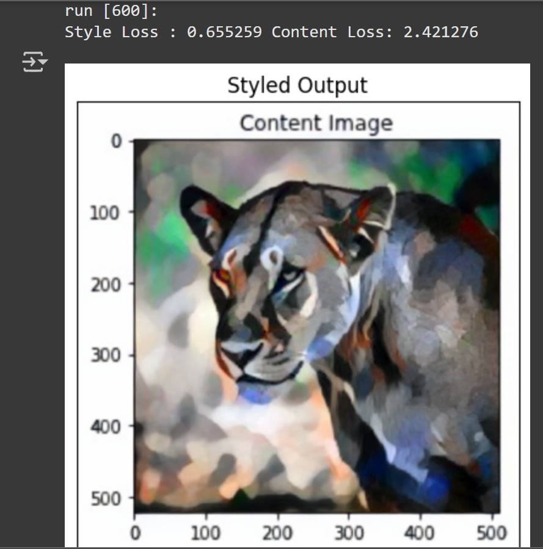

# ArtMorph
A neural network based model which is used to transfer the style from the style image to the content Image
 
It takes two images as input content image and style image and transfer the style from style image to content image
 
The accuracy acheived is around 99.4% with 600 epochs
 

<h6>Steps to Run</h6>
1. Clone the repo
 
2. Run each cell of the Jupyter notebook

<h6> Output </h6>

